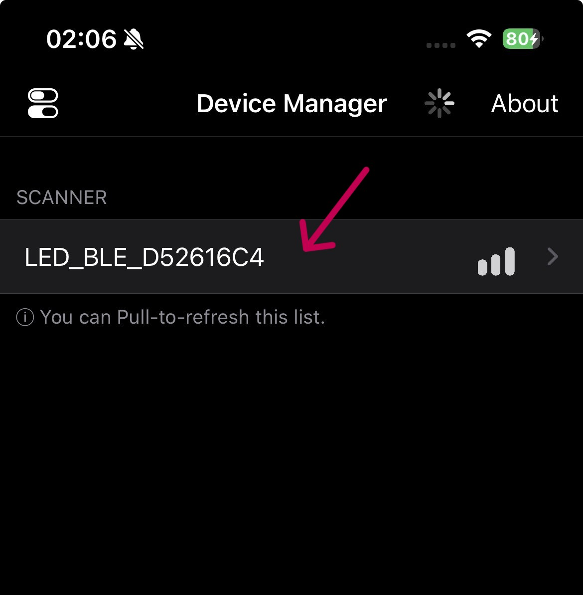
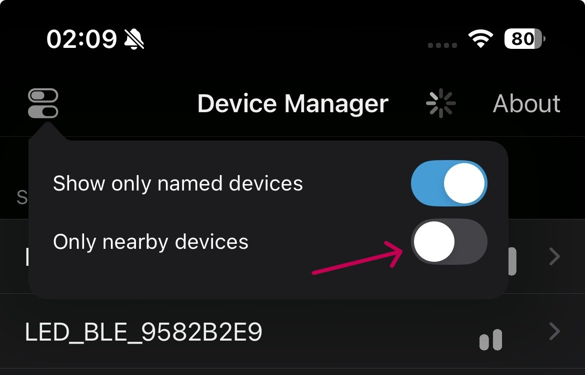
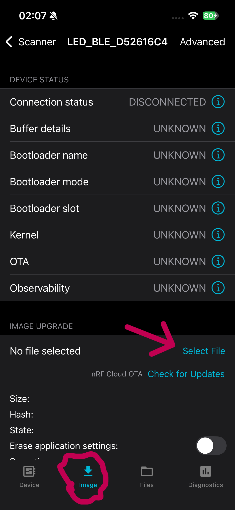
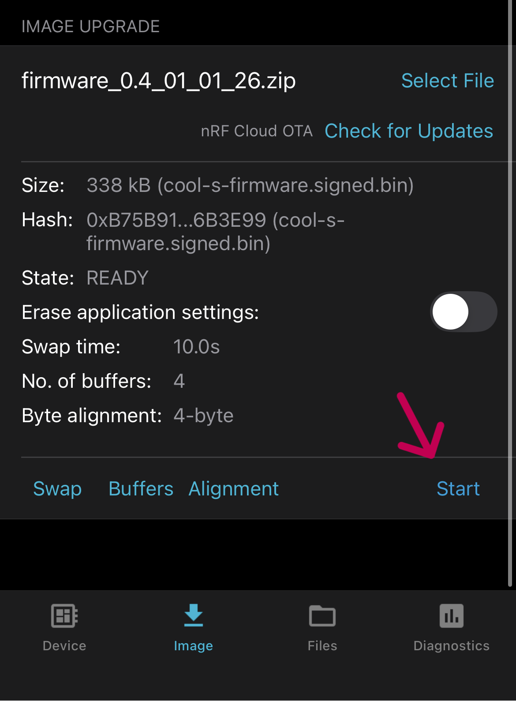
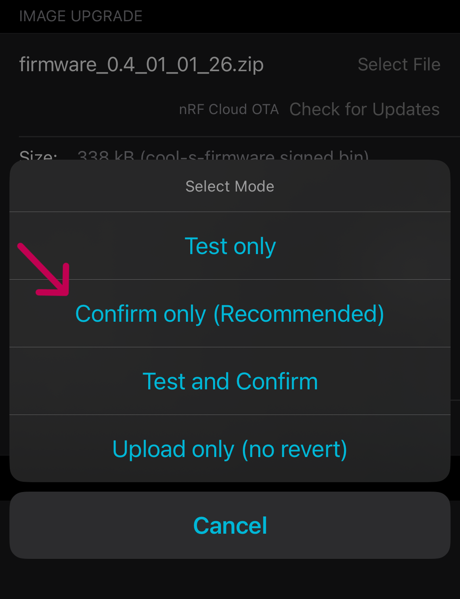
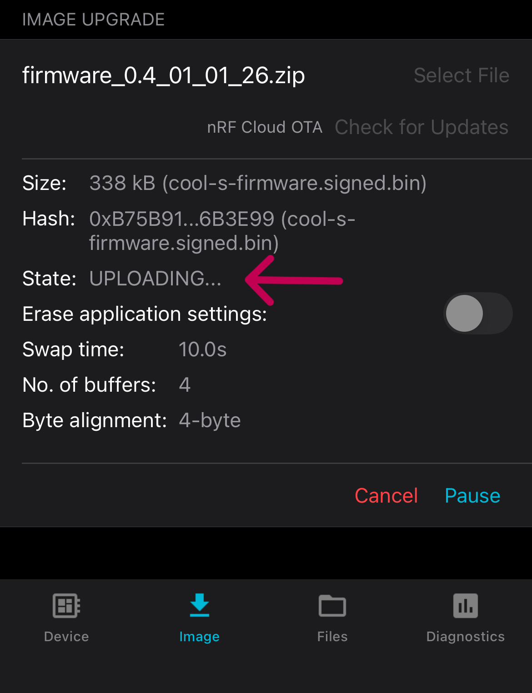
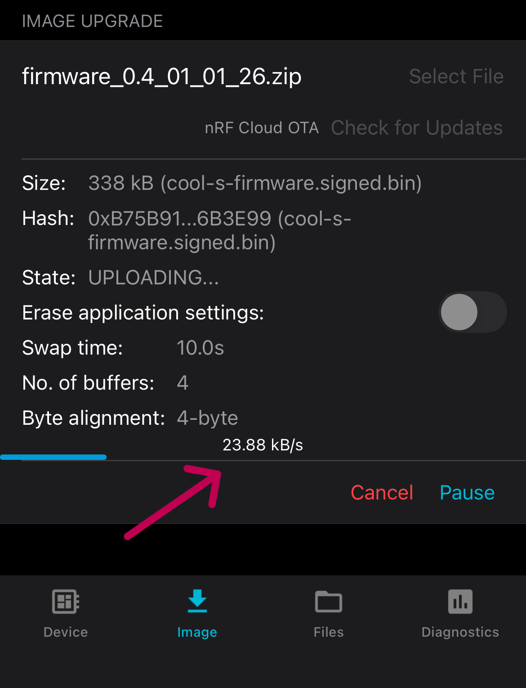
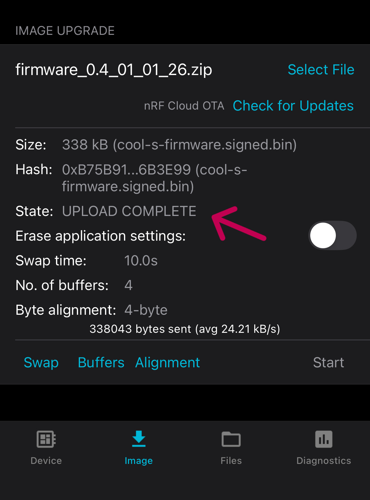

OTA Firmware Update Instructions
=============================

- Install Nordic Device Manager app: https://www.nordicsemi.com/Products/Development-tools/nRF-Connect-Device-Manager

- Download the latest firmware .zip file from the root of this repository. (e.g. cool-s-firmware-v0.4.zip)

- Open the Nordic Device Manager app.

- Click on the "LED_BLE_XXXXXXXX" device in the list. (with XXXXXXXX being the last four bytes of the MAC address)

- If the device does not appear click on the filter icon and untick the "Only nearby devices" option. If its still not showing make sure the device has power.

- Go to the "Image" tab, scroll down and click on the "Select file" button to choose the downloaded .zip firmware file.

- Click on the "Start" button to start the firmware update.

- A popup will ask what type of update to run. Select the recommended "Confirm only" option. If you misclicked don't worry, it will likely still apply the update correctly. If not just start over.

- Wait for the update to complete. This may take up to a minute. It should show the "Uploading" message and then start a progress bar after a few seconds. If it immediately says "Upload complete" then you already have the latest firmware installed.

- After the upload is complete the device will reboot and should show up again in the device list after about 30 seconds. You can go back to the iPixel app and reconnect to it to verify the new firmware is working. No need to keep the Device Manager app open after the Update Complete message is shown.

